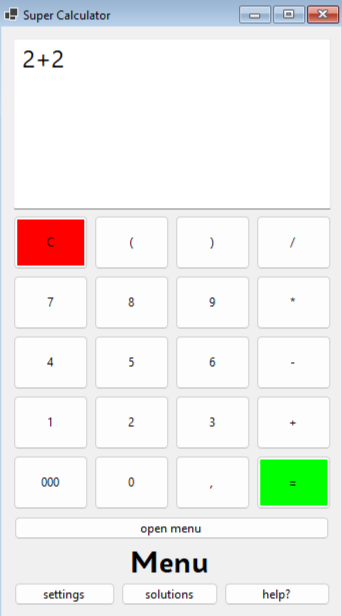

# Simple-Winforms-Calculator-With-Databases

A simple calculator application. The application has its own customization menu (settings button), you can customize the colors of the buttons and, and other parameters. The application also has two tabs: solutions (saved solutions) and a simple help page. The application uses SQLite databases to save changes to customization parameters and save mathematical solutions.

